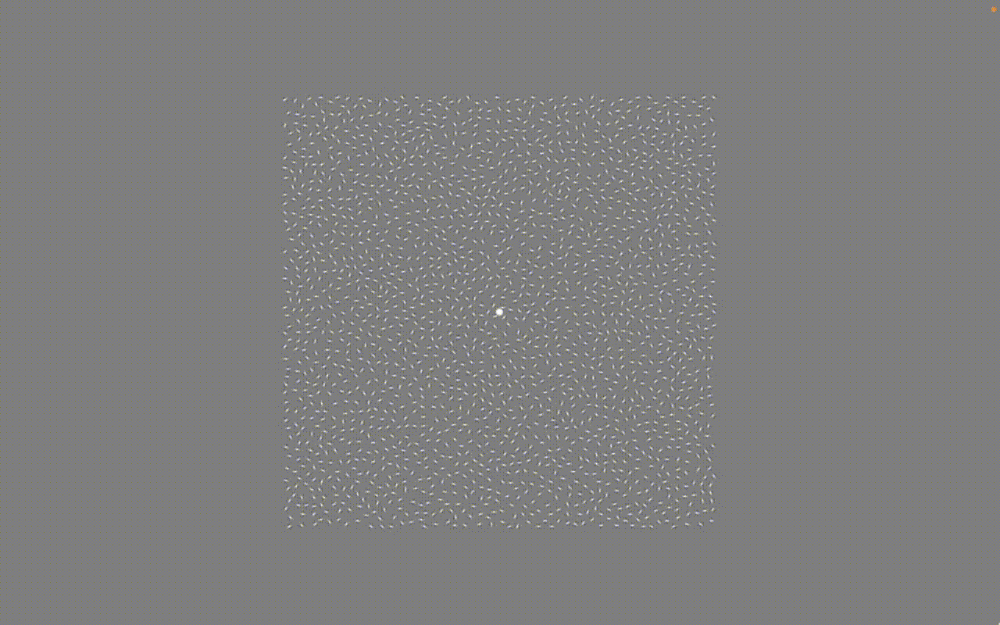

# Gabor Object Recognition PsychoPy Experiment


This is a [Psychopy](https://psychopy.org) project consisting of an experiment based on a task described in an [article by Sapey-Triomphe et al.](https://www.sciencedirect.com/science/article/pii/S2213158220300346). In each experiment trial, participants are shown reels of images (videos) with 'Gabor patches'. Throughout each reel, the gabor patches shift slightly in orientation. In some trials, the end result is that the gabor patches form a pattern (e.g. an object like a car, or a more amorphous shape/'blob') - in other trials, the end result is entirely random, with no particular pattern. Participants are asked to press a key (or a button, if using a button pad configured to send keyboard signal) whenever they perceive a pattern.

The experiment was designed to be run during fMRI scanning - see 'Configuring the experiment' below if you wish to run it outside of a scanner.

__PLEASE NOTE__ that in order for this project/experiment to work, you _must_ have stimuli files from Sapey-Triomphe et al. (see section 'Attributions'), and have added them to the project as described in the section 'Stimuli' below.

## Running the experiment
1. Install [Standalone PsychoPy](https://www.psychopy.org/download.html).
2. Download this project, by either using the green 'code' button and selecting 'Download ZIP', or by using `git clone` if you know Git.
3. Open up 'gabor_object_recognition.psyexp' with PsychoPy.
4. Click the cogwheel ('Edit experiment settings') icon, go to the 'Screen' tab, and insert specifications appropriate for your monitor(s) (if you haven't already, you also need to do setup in Monitor Center - please see the [PsychoPy documentation](https://www.psychopy.org/)).
5. Click the Play ('Run experiment') icon.

Note that:
* By default, the keyboard key '3' corresponds to pressing the 'left button' referred to in the instructions, and '1' corresponds to pressing the 'right button'.
* After the participant has finished going through all instructions, the experiment waits for a '5' keyboard press signal.
    - This is to represent an MR scanner signalling that scanning is starting.

See 'Configuring the experiment' below for more information.

## Configuring the experiment
### If running the experiment outside of a scanner
To make the experiment skip past waiting for an MR scanner signal:
1. Open up the experiment with the PsychoPy Builder (the default view when using Standalone PsychoPy).
2. In the 'flow' subwindow at the bottom of the Builder view, find the 'wait_for_mr_signal' routine.
3. Right-click the routine and select 'remove'.
4. Save the experiment.

### If running the experiment during fMRI scanning
You need to find out what signal the MR scanner sends to tell the experiment computer that scanning is starting - e.g. the default in the experiment is a signal corresponding to the keyboard key '5'. Once you've done this:
1. Open up the experiment with the PsychoPy Builder (the default view when using Standalone PsychoPy).
2. Go to the 'instructions_part_one' routine.
3. Click the 'code_constants' code component.
4. Scroll down to this line: `MR_TRIGGERKEY_TUPLE = ('5',)`.
5. Replace the '5' with whatever key the MR scanner signal corresponds to, e.g. `MR_TRIGGERKEY_TUPLE = ('1',)`.
6. Save the experiment.

### Other configurations
Many of the relevant configurations, e.g. what keyboard key signals to interpret as 'left/right button' and duration of each image in the trial 'reels', are specified in the 'code_constants' component mentioned above. Other changes are made in the other routines/components making up the experiment.

## Stimuli
This experiment uses stimuli from the original article by Sapey-Triomphe et al. (see 'Attributions' below). Unfortunately, the stimuli cannot be included in this repository. If you are given permission by Sapey-Triomphe & colleagues to use their experiment, and are sent a copy of their stimuli, the images should be placed inside of a 'stimuli' directory in a directory hierarchy as follows:

```bash
stimuli
├── Gabor stimuli Sapey Boets
│   ├── RFP_OPP
│   ├── RFP_RCP
│   ├── RFP_RCR
│   ├── RFP_RRR
│   └── Snod_RCP
└── grey
```

The directories should contain image sequences as follows:
* RFP_RRR: Random pattern stimuli images
* RFP_RCR: Contour stimuli images
* RFP_OPP: Texture stimuli images
* RFP_RCP: Contour & Texture stimuli images
* Snod_RCP: Contour # Texture Meaningful stimuli images
* grey: 'blank' (no stimulus) images

## Experiment flow / trials
### 'Runs'
The experiment consists of two 'runs', each consisting of 54 trials (i.e. 108 trials in total). The runs are run one after the other, without any pause inbetween.

### Contents of a single 'run'
Of the 54 trials in a run, 14 are 'fixation trials' where no pattern is shown, and participants are instead to simply focus on a centered white dot.

40 trials are 'active' trials, meaning a reel of images with Gabor patch is shown. Of these:
* 10 are 'Random' trials, where no pattern emerges at the end of the reel.
* 10 are 'Contour' trials, where the contours of a meaningless shape ('blob') becomes apparent toward the end of the reel.
* 10 are 'Contour & Texture Meaningless' trials, where the contours of a meaningless shape ('blob'), _where all Gabor patches within the contour share a common orientation_ (texture), becomes apparent toward the end of the reel.
* 10 are 'Contour & Texture Meaningful' trials, where the contours of a meaningful shape (e.g. a car), _where all Gabor patches within the contour share a common orientation_ (texture), becomes apparent toward the end of the reel.

Each trial lasts roughly 5.9-6.1 seconds. In 'active' trials, during the first 5400ms a reel of 12 images (frames) is shown. The first 11 images are shown for 355ms each, while the final image is shown for 1495ms. A grey screen is displayed during the last 500, 600 or 700ms - this duration is 'pseudo-jittered' throughout the experiment in a manner that ensures that the mean trial duration is 6s.

Trial order within runs is, for each participant, randomly determined by using Python's built-in `shuffle` function.

## Output data
The most relevant output data files are the 'CSV'/'.csv' files, saved to the 'data' directory. The most important columns in these files are as follows:

* stimulus_type: Type of stimulus/trial: 'contour', 'contour_texture' ('Contour & Texture Meaningless'), 'contour_texture_meaningful', 'grey' ('fixation' trial) or 'random'.
* stimulus_path: Path describing the file path to images making up the trial's 'reel'.
    - Use this to see what particular reel was shown during the trial.
* key_resp_trial.keys: What key/button (e.g. '3' if the participant pressed the left button, and this is mapped to sending a keyboard signal of '3') was pressed by the participant.
    - Has value `None` if the participant didn't press any key/button.
* key_resp_trial.rt: Participant response time, counting from trial start.
    - Left blank if the participant didn't press any key/button.
* key_resp_trial.started: Trial start time, counting from experiment start.
* blank_image.started: Time at which 'blank'/grey image at end of trial (of duration between 500-700ms) started being shown.

## Differences from original experiment
Here, 'original' refers to the experiment described by Sapey-Triomphe et al., while 'this experiment' refers to this project's experiment.
* The original included five conditions (Random, Contour, Texture, Contour & Texture Meaningless, Contour & Texture Meaningful). This experiment only uses four conditions: Random, Contour, Contour & Texture Meaningless, Contour & Texture Meaningful.
* The original had two 'runs' of the experiment, with 67 trials each, separated by a pause. This experiment does have two 'runs', as described above, but no pause.
* The original had 50 'active' trials in each run, while this experiment only has 40 (due to excluding one of the conditions).
* The original had 17 'fixation trials' in each run, while this experiment has 14 per run. This is done in order to keep the ratio of fixation to active trials approximately the same as in the original.
* The original had the same trial duration, 6000ms, for all trials. The last 600ms of each trial displayed a grey screen. This experiment has a mean trial duration of 6000ms, but it (and the 'end grey screen duration') is jittered such that trials can have durations of 5900, 6000 or 6100ms.
* The original's trial order was "optimally counterbalanced by means of a genetic algorithm" (see article for more details). This experiment simply uses Python's built-in `shuffle` function in order to shuffle trial order within runs.

## Translating the experiment
The default language is English. In PsychoPy, click the Text Components (e.g. in the routine 'instructions' there is a component 'text_instructions'). In the window that pops up, edit the 'Text' field. Once you've finished translating the experiment, save it ('Save current experiment file' in main window toolbar) and try running it again.

You can find a Swedish translation in the 'translations' directory.

## Attribution
This Psychopy experiment was coded at Karolinska Institutet (KI) by Lowe Wilsson, while working in Janina Neufeld's research group. The experiment itself is based on, and uses stimuli from, this article:
> Sapey-Triomphe, L.-A., Boets, B., Van Eylen, L., Noens, I., Sunaert, S., Steyaert, J., & Wagemans, J. (2020). Ventral stream hierarchy underlying perceptual organization in adolescents with autism. NeuroImage: Clinical, 25, 102197.

Note that there are some differences between this experiment and the original task described by Sapey-Triomphe et al. The greatest differences are described above, but you may wish to also compare the article with the information in this README and in the PsychoPy Builder project itself for additional details. Decisions on modifications of experiment design were primarily made by Janina Neufeld at KI and Tessa M. van Leeuwen of Radboud University.

You are _not_ free to use or modify this experiment (Wilsson has contacted Boets but did not get approval for this before Wilsson's employment at Karolinska Institutet ended). You may _only_ use/modify this experiment if you get permission from the original article authors (Sapey-Triomphe et al.; additional permission from Wilsson is not required). Moreover, if you publish articles or share other work based on this project (e.g. if you share a modified version of it), you are required to cite the Sapey-Triomphe et al. article above and link to this project's [GitHub repository](https://github.com/AnonZebra/gabor-patterns-psychopy). Please make sure to note, e.g. in the methodology section, that this experiment is not exactly the same as that used by Sapey-Triomphe et al.